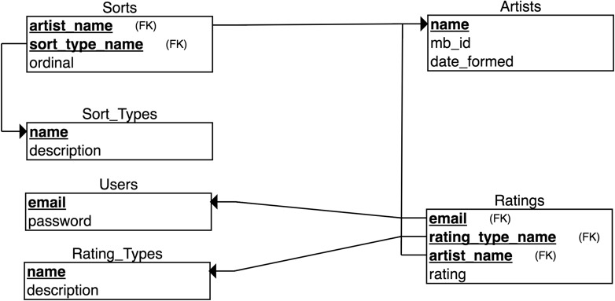
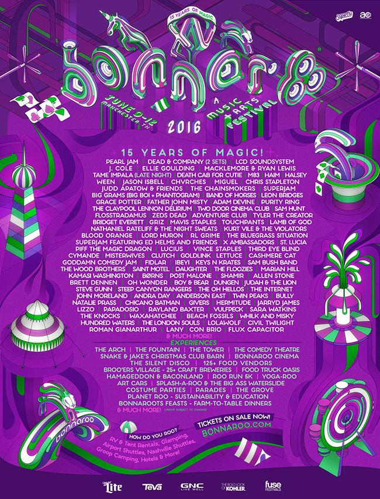

# Festival Data
### A Running Example Schema with Data for Compose Articles

This simplified schema models a music festival lineup.  

It seeds the model with lineup information from the 
2016 Bonnaroo Music Festival.  

The relevant files are in `postgres/`.
